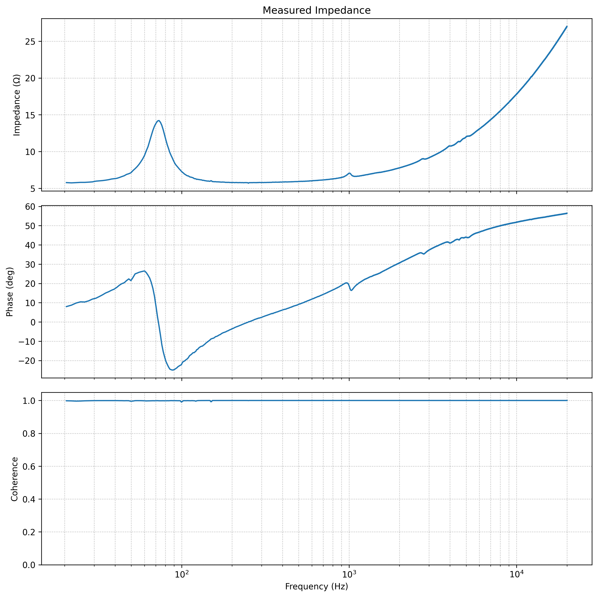

# Open Impedance Lab

OpenImpedanceLab is an open-source audio impedance measurement toolkit for turning commodity sound hardware into a high-performance impedance analyzer.

* 3-point calibration workflow: channel mismatch, open, and short
* Calibration stored in a `.cal` file
* Coherence-weighted transfer function estimation
* Automatic export of `.csv` files with magnitude, phase, and coherence
* Example use case: measure a loudspeaker’s electrical impedance from 20 Hz to 20 kHz using a simple voltage-divider setup with one sense resistor

```text
Soundcard line out ──+── series resistor (e.g. 22 Ω) ──+── DUT / driver ── GND
                     │                                 │
                     │                                 └── soundcard line in (channel 2)
                     └────────────────────────────────────── soundcard line in (channel 1)
```

## Example Measurement

Example impedance measurement of a loudspeaker:



Licensed under the GNU Affero General Public License v3.0 (AGPL-3.0).
